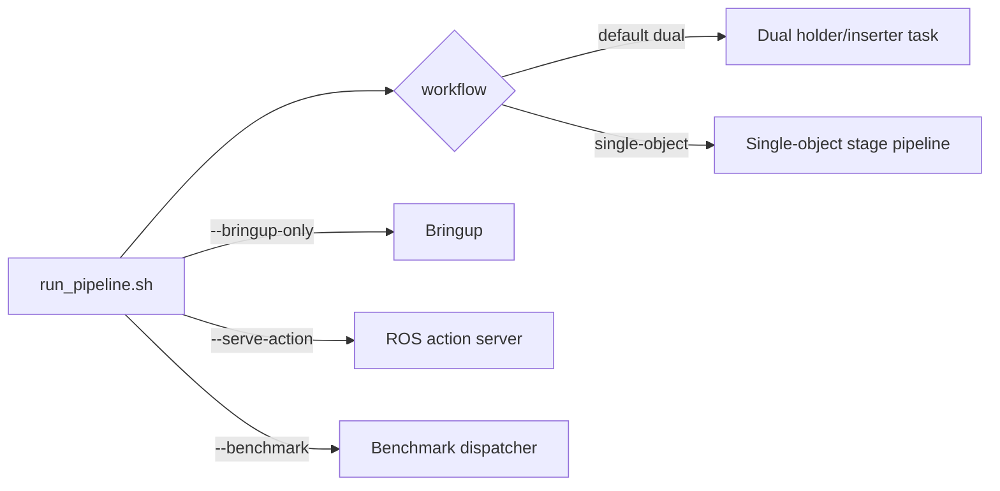
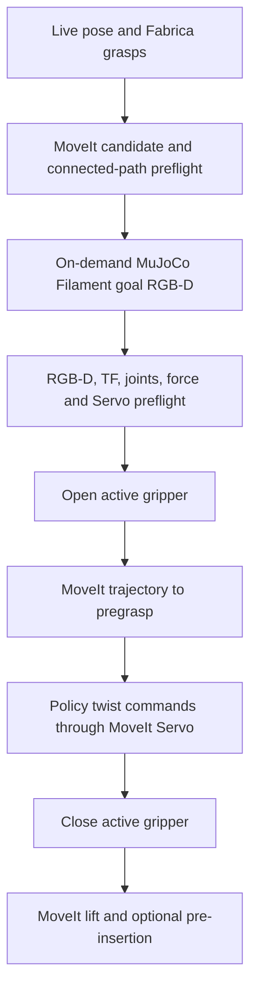
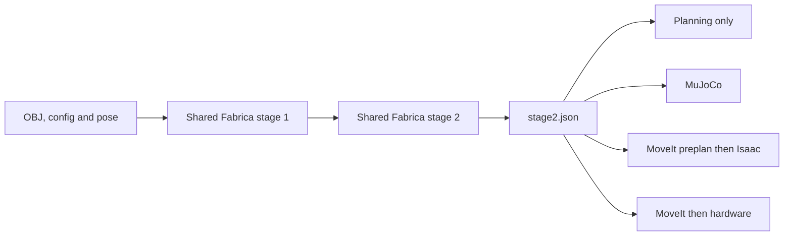
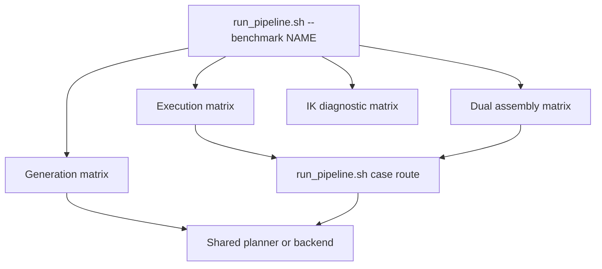

# Unified Execution And Benchmark Paths

The repository has one public command and one public environment setup:

```bash
cd /media/pdz/Elements1/Grasp_Planning_hold_grasping
source ./setup_robot_env.sh
./run_pipeline.sh ...
```

`run_pipeline.sh` is the user boundary for dual-arm tasks, one-active-robot
tasks, single-object simulation, ROS action serving, bringup, policy-assisted
approaches, and benchmarks. Older root scripts remain compatibility shims only.

## Default Task Contract

The default workflow is the dual holder/inserter task.

- `--robots both` is the default.
- With no policy, grasp approaches are deterministic MoveIt-planned motions.
- A normal real run grasps with both task roles, lifts the incoming part, and
  moves the inserter to the pre-insertion pose. It does not insert.
- `--grasp-only` (also accepted as `--grasp_only`) stops after pickup lift. It
  does not transport the incoming part to pre-insertion.
- `--robots left|right` starts and moves only that physical robot. The other
  robot remains a mock collision body in the shared planning scene.
- A single active robot assumes the `inserter` task role unless
  `--role holder` is supplied.
- `--policy NAME_OR_CHECKPOINT` is real-only. The same selected policy replaces
  every active pregrasp-to-grasp segment; all other segments remain MoveIt
  trajectories.
- Hardware trajectory execution still requires `--execute` and the normal
  confirmation gate unless `--yes` is deliberately supplied.



## Common Commands

### One environment

```bash
source ./setup_robot_env.sh                         # both robots, ROS domain 0
source ./setup_robot_env.sh --robots left          # left hardware context
source ./setup_robot_env.sh --robots right --ros-domain-id 7
```

`setup_dual_robot_env.sh` and `setup_ros2_hardware_env.sh` source this file for
backward compatibility. New commands should use only `setup_robot_env.sh`.

In real dual bringup, each arm has its own `ros2_control` manager under
`/lbr_dual_arm/lbr_one_control` or `/lbr_dual_arm/lbr_two_control`. This avoids
colliding upstream LBR sensor resource names. Their states are merged into
`/lbr_dual_arm/joint_states` for the one shared MoveIt scene. Mock bringup keeps
the simpler combined manager.

Execution reuses this persistent MoveIt stack by default. If the expected
services are absent it fails fast without starting or stopping robot bringup.
Use `--start-moveit` only for a temporary wrapper-owned stack, such as a
self-contained simulation smoke test.

### Bringup

```bash
# Both physical arms in one collision-aware MoveIt scene.
./run_pipeline.sh --mode real --robots both --bringup-only --rviz

# Only the left physical arm; right stays as a mock collision body.
./run_pipeline.sh --mode real --robots left --bringup-only --rviz

# Policy execution also starts per-arm MoveIt Servo.
./run_pipeline.sh --mode real --robots left --policy clutter-v5 --bringup-only --rviz
```

The new persistent grippers are separate ROS nodes and use these namespaces:

```text
/left/gripper_controller/{calibrate,open,close,stop}
/right/gripper_controller/{calibrate,open,close,stop}
/left/gripper_controller/position_command
/right/gripper_controller/position_command
/left/gripper_controller/position
/right/gripper_controller/position
```

Their calibrated jaw range is 7–74 mm. Position commands are closure fraction:
`0.0` is fully open and `1.0` is fully closed. Real execution fails before any
arm motion if an active role's required gripper service is absent.

MoveIt bringup mirrors the physical `position` feedback into its passive finger
joints and republishes the latest measurement at 20 Hz, even after motion has
finished. A physical side with no reading yet is shown fully open with a
warning; it is never silently assigned an unknown finger coordinate.

### Real task execution

```bash
# Both roles: grasp, pickup lift, then inserter pre-insertion. No insertion.
./run_pipeline.sh --mode real --robots both --execute

# Both roles: grasp and pickup lift only. No transport.
./run_pipeline.sh --mode real --robots both --grasp-only --execute

# Left robot only, default inserter role: grasp and lift.
./run_pipeline.sh --mode real --robots left --grasp-only --execute

# Right robot only acting as holder.
./run_pipeline.sh --mode real --robots right --role holder --execute
```

Every real candidate is checked in the live MoveIt scene. The executor uses the
exact connected collision-aware preplans accepted during candidate selection;
it does not serialize a second grasp representation.

### Policy-assisted real grasp

```bash
# One registered policy for both active grasp approaches.
./run_pipeline.sh --mode real --robots both --policy clutter-v5 --execute

# One arm, with an explicit camera swap.
./run_pipeline.sh --mode real --robots left --grasp-only \
  --policy /path/to/checkpoint.pth --left-camera realsense_2 --execute

./run_pipeline.sh --list-policies
```

An explicit checkpoint needs its deployment metadata sidecar, including the
checkpoint hash and trained gripper embodiment. A named registry entry resolves
the same metadata through `configs/d405_policy_registry.yaml`.



The policy owns only pregrasp-to-grasp. MoveIt Servo applies the live planning
scene's collision scaling to policy twist commands. The executor requires the
policy completion/close gate before closing the gripper. Goal rendering is
on-demand from the selected grasp and uses MuJoCo Filament; it does not start
Isaac. The run artifact includes `policy_execution_debug.html` with goal RGB
and colorized depth for each active role.

### ROS action serving

```bash
./run_pipeline.sh --mode real --robots both --serve-action --execute

# One active inserter, policy approach, stop after lift.
./run_pipeline.sh --mode real --robots left --serve-action --grasp-only \
  --policy clutter-v5 --execute
```

The action server is an adapter to the same `run_pipeline.sh` task route. It
does not own a separate execution implementation.

## Simulation And PITL

The legacy single-object stage-1/stage-2 workflow is still available explicitly:

```bash
./run_pipeline.sh --workflow single-object --mode sim --backend mujoco
./run_pipeline.sh --workflow single-object --mode sim --backend isaac --headless
./run_pipeline.sh --workflow single-object --mode pitl --backend both --headless
```

`sim` reads the configured YAML world pose. `pitl` receives the object pose from
ROS perception, but still executes in MuJoCo and/or Isaac. `pitl` does not move
hardware. `real` receives the same ROS pose type and may move hardware only when
execution is explicitly enabled.

All backends consume the saved stage-2 bundle as their source of truth:



For a saved-stage2 Isaac attempt, `run_pipeline.sh` performs host-side MoveIt
preplanning before entering the IsaacLab Python runtime. This keeps collision
planning out of benchmark code and avoids requiring Isaac's Python environment
to import the host ROS installation.

## Consolidated Benchmarks

Benchmarks are selected at the same public boundary:

```bash
./run_pipeline.sh --benchmark grasp-generation --limit-parts 1
./run_pipeline.sh --benchmark grasp-execution --backend both --limit-attempts 10
./run_pipeline.sh --benchmark dual-assembly --limit-cases 4
./run_pipeline.sh --benchmark solo-pickup-ik --limit-cases 4
```

| Benchmark | What it owns | What it delegates |
| --- | --- | --- |
| `grasp-generation` | Dataset iteration, metrics, summaries | Stage 1 and stage 2 use the shared Fabrica pipeline modules; no execution |
| `grasp-execution` | Case selection, placement variants, logs, videos, aggregation | Every MuJoCo/Isaac attempt calls `run_pipeline.sh` with its saved stage-2 bundle; the unified route owns Isaac MoveIt preplanning |
| `dual-assembly` | Case matrix, resume/repair, aggregation | Every planning/execution case calls `run_pipeline.sh --workflow dual`; shared mock bringup also uses `run_pipeline.sh --bringup-only` |
| `solo-pickup-ik` | Planning-only A/B diagnostic matrix and metrics | Selected only through `run_pipeline.sh`; it does not execute physics or hardware |



Benchmark scripts are internal matrix/aggregation adapters. They are not
alternate user-facing execution entrypoints and they do not authorize hardware
motion.

## Stop Boundaries

| Selection | Final phase |
| --- | --- |
| both, default | `inserter_preinsertion` |
| both, `--grasp-only` | `inserter_pickup_lift` |
| one robot, default inserter | `inserter_preinsertion` |
| one robot, inserter + `--grasp-only` | `inserter_pickup_lift` |
| one robot + `--role holder` | `holder_grasp` |

`--grasp-only` includes lift. It means no transport, not stop immediately after
finger closure.

## Internal Adapters And Compatibility Shims

These remain implementation details because the pipeline and tests need
separable components:

- `scripts/run_unified_pipeline.py`: public CLI dispatcher behind the shell wrapper.
- `scripts/run_dual_pipeline.sh`: dual task process supervisor.
- `scripts/run_grasp_pipeline.py`: single-object YAML stage orchestrator.
- `scripts/run_fabrica_grasp_in_mujoco.py`: saved-bundle MuJoCo backend.
- `scripts/run_fabrica_grasp_in_isaac.py`: saved-bundle Isaac backend.
- `scripts/run_simple_dual_robot_real.py`: dual hardware executor adapter.
- `run_simple_dual_robot.sh`: compatibility shim to `run_pipeline.sh --workflow dual`.
- `run_single_arm_policy_pickup.sh`: compatibility shim for the explicit
  single-object policy pickup route.

The dual process supervisor owns its child process group and tears down MoveIt,
Servo, render helpers, and simulators on normal completion, failure, or signal.
On-demand goal rendering also uses bounded subprocess cleanup, so Isaac or
renderer processes are not intentionally left running after a pipeline run.

Use `./run_pipeline.sh --dry-run ...` to inspect the exact resolved internal
command without starting ROS, a simulator, or hardware.
