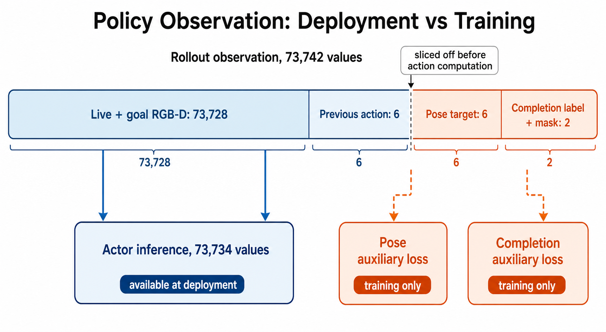
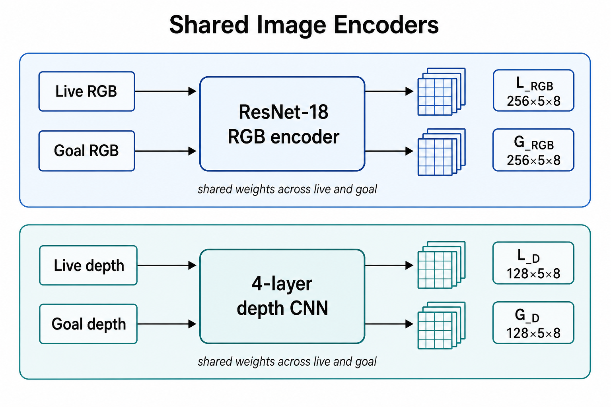
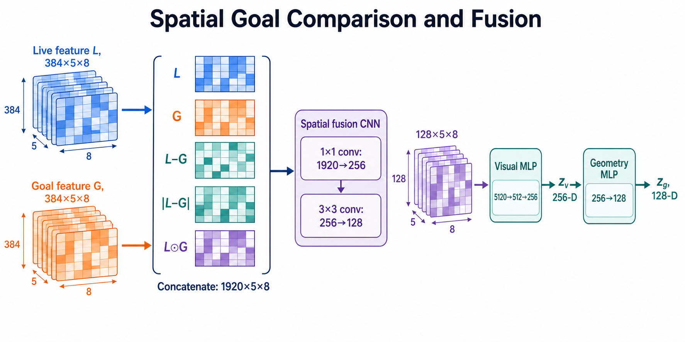
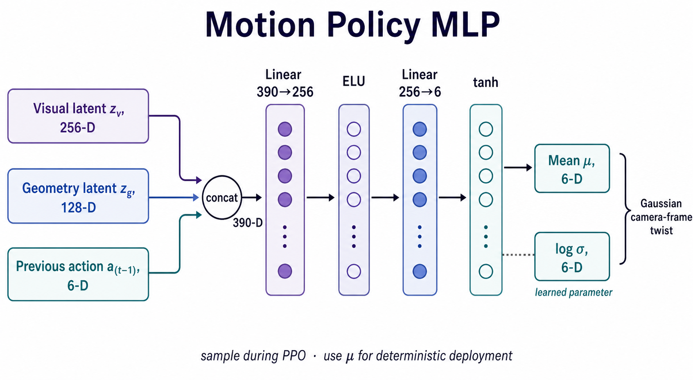
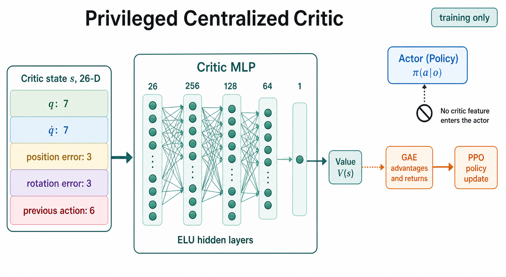
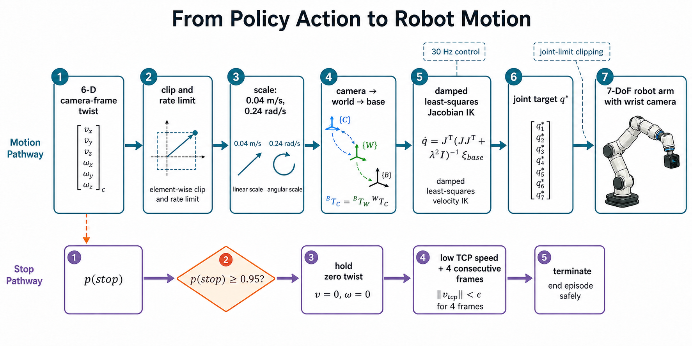

# Current RGB-D Reinforcement-Learning Architecture

This note explains the complete visual-servo RL loop in enough detail to
reimplement it. The deployed policy aligns the robot TCP to a selected grasp
by comparing a live wrist-camera RGB-D image with a canonical goal RGB-D image.
The central idea is simple: **learn the residual camera-frame motion that makes
the live view look like the desired grasp view, and learn when to stop.**

## 1. End-to-end pipeline

At every control step the policy produces six normalized camera-frame velocity
commands and one completion decision. The environment rate-limits the motion,
converts it from camera to world to robot-base coordinates, uses damped
least-squares Jacobian inverse kinematics, and sends a joint-position target.
There is no nominal motion controller underneath the learned policy.

An episode first chooses a catalog target: a part, object pose, grasp pose,
canonical goal image, and collision-validated approach/reset path. Multipart
training balances targets by part. Resets mix ordinary path states, exact
authored states, near-complete states, and completion-boundary states. A
curriculum gradually expands path distance, pose perturbation, appearance
randomization, and hard-target replay. This matters because the network is not
trained only from a single fixed starting pose.

## 2. Observations and actions

The rollout observation has 73,742 values per environment:

| Segment | Shape | Used at deployment? | Purpose |
|---|---:|:---:|---|
| Live RGB-D | `72 x 128 x 4` | yes | Current wrist-camera view |
| Goal RGB-D | `72 x 128 x 4` | yes | Desired grasp view |
| Previous motion action | `6` | yes | Minimal temporal context |
| Camera-frame pose-error target | `6` | no | Auxiliary supervision |
| Completion label + mask | `2` | no | Auxiliary supervision |

The full stored observation is

$$
o_t^{\mathrm{rollout}}
= \left[
I_t^{\mathrm{live}},\ I^{\mathrm{goal}},\ a_{t-1},\
e_t^{\mathrm{pose}},\ y_t^{\mathrm{stop}},\ m_t^{\mathrm{sup}}
\right] \in \mathbb{R}^{73\,742}.
$$

The two RGB-D images account for $72\cdot128\cdot8=73\,728$ values. The network
slices off the final eight privileged labels before calculating an action.
Consequently, ground-truth pose cannot leak into deployed inference.

The centralized critic receives a separate 26-D privileged state:

$$
s_t = [q_t,\ \dot q_t,\ e_t^p,\ e_t^R,\ a_{t-1}]
\in \mathbb{R}^{7+7+3+3+6}=\mathbb{R}^{26}.
$$

The action is hybrid rather than a seven-dimensional Gaussian:

$$
u_t \sim \mathcal{N}\!\left(\mu_\theta(o_t),
\operatorname{diag}(\sigma_\theta^2)\right),
\qquad
c_t \sim \operatorname{Bernoulli}\!\left(p_\theta(o_t)\right).
$$

Their negative log probabilities and entropies are added so PPO treats them as
one joint action distribution.

## 3. Actor network

Live and goal images pass through the same encoders (Siamese weight sharing).

### RGB and depth encoders

- RGB: ImageNet-pretrained ResNet-18 through layer 3, producing
  `[B,256,5,8]`. The stem, layer 1, and layer 2 are frozen; layer 3 trains.
  All ResNet BatchNorm running statistics remain frozen.
- Depth: four stride-2 convolutions (`1->32->64->96->128`) with ELU,
  producing `[B,128,5,8]`.

RGB and depth features are concatenated for each image:

$$
L=[L_{\mathrm{RGB}};L_D],\qquad
G=[G_{\mathrm{RGB}};G_D],\qquad
L,G\in\mathbb{R}^{B\times384\times5\times8}.
$$

The spatial comparison tensor is

$$
X=\operatorname{concat}\!\left(L,G,L-G,|L-G|,L\odot G\right)
\in\mathbb{R}^{B\times1920\times5\times8}.
$$

This explicitly exposes appearance, signed error, error magnitude, and feature
agreement while retaining the `5 x 8` spatial grid.

### Fusion and shared trunks

The fusion CNN maps $1920\rightarrow256\rightarrow128$ channels. Flattening
the resulting $128\times5\times8=5120$ tensor gives

$$
z_v=\operatorname{MLP}_{5120\rightarrow512\rightarrow256}(X),
\qquad
z_g=\operatorname{ELU}(W_gz_v+b_g)\in\mathbb{R}^{128}.
$$

The geometric latent is therefore derived from the visual latent; it is not a
parallel encoder.

### Motion, completion, and pose heads

The heads are:

$$
\begin{aligned}
\mu_t &={\tanh}\!\left(\operatorname{MLP}_{390\rightarrow256\rightarrow6}
([z_v,z_g,a_{t-1}])\right),\\
\ell_t^{\mathrm{stop}}
&=\operatorname{MLP}_{384\rightarrow128\rightarrow1}([z_v,z_g]),\\
\hat e_t^{\mathrm{pose}}
&=\operatorname{MLP}_{128\rightarrow128\rightarrow6}(z_g),\\
p_t^{\mathrm{stop}}&=\sigma(\ell_t^{\mathrm{stop}}).
\end{aligned}
$$

The Gaussian has one learned log-standard-deviation parameter per motion axis.
When completion confidence rises above 0.70, a smooth scale reduces both the
motion mean and standard deviation, reaching a 0.25 scale at certainty. This
scale uses `p(stop).detach()`: completion affects motion magnitude, but the
motion loss cannot update the completion head through this connection.

## 4. How the heads share information

The heads do **not** pass hidden states to one another. They communicate through
the shared features and the gradients accumulated in shared parameters:

$$
\mathcal{L}_{\mathrm{actor}}
=\mathcal{L}_{\mathrm{PPO}}
+0.2\,\mathcal{L}_{\mathrm{pose}}
+0.2\,\mathcal{L}_{\mathrm{completion}}.
$$

Thus the shared representation must support control, geometric-error
prediction, and completion recognition. The pose loss compares the pose-head
prediction directly with the privileged pose target. **It never uses the
critic output.** Likewise, completion BCE compares the completion logit with
the privileged ready label, ignoring samples in the ambiguity band via its
mask.

$$
\mathcal{L}_{\mathrm{pose}}
=\operatorname{SmoothL1}(\hat e_p,e_p)
+\operatorname{SmoothL1}(\hat e_R,e_R),
$$

$$
\mathcal{L}_{\mathrm{completion}}
=\frac{\sum_i m_i\,
\operatorname{BCEWithLogits}(\ell_i^{\mathrm{stop}},y_i;w_+=3)}
{\max(1,\sum_i m_i)}.
$$

## 5. Critic and PPO update

The centralized critic is the independent function

$$
V_\phi(s_t)=\operatorname{MLP}^{\mathrm{ELU}}_{26\rightarrow256\rightarrow128
\rightarrow64\rightarrow1}(s_t).
$$

It is available only during training. Its value estimate supplies returns and
advantages to PPO; no critic features are fed into the actor. This is the
meaning of *asymmetric actor-critic*: the critic may use simulator truth to
reduce training variance, while the actor is restricted to deployable inputs.

For each 64-step rollout, PPO evaluates the stored hybrid actions under the
updated policy. In simplified form, one minibatch optimizes

$$
\mathcal{L}
=\mathcal{L}_{\mathrm{PPO\text{-}clip}}
+\frac{c_v}{2}\mathcal{L}_{V}
+10^{-3}\mathcal{L}_{\mathrm{bounds}}
-c_H\mathcal{H}_{\mathrm{hybrid}}
+0.2\mathcal{L}_{\mathrm{pose}}
+0.2\mathcal{L}_{\mathrm{completion}},
$$

with

$$
\mathcal{L}_{\mathrm{PPO\text{-}clip}}
=-\mathbb{E}_t\!\left[
\min\!\left(r_t\hat A_t,
\operatorname{clip}(r_t,1-\epsilon,1+\epsilon)\hat A_t\right)
\right],
\qquad \epsilon=0.1.
$$

Here `critic_coef=2`, `entropy_coef=0`, PPO clipping is `0.1`, the learning rate
starts at `5e-5` and decays linearly, gradients are clipped to norm `0.5`, and
each rollout is reused for two mini-epochs. The hybrid PPO KL is the sum of the
six-dimensional Gaussian KL and Bernoulli KL.

## 6. Environment control, reward, and stopping

The sampled motion is clipped to `[-1,1]`; its change from the preceding action
is limited to `0.25` per step. Translation is scaled to at most `0.04 m/s` and
rotation to `0.24 rad/s`. A high stop signal immediately commands zero twist.

After rotating the twist $\xi_t$ from camera to base coordinates, the
environment computes

$$
\dot q_t
=J_t^\top\!\left(J_tJ_t^\top+\lambda^2I\right)^{-1}\xi_t^{\mathrm{base}},
\qquad
q_{t+1}^{*}=\operatorname{clip}_{\mathrm{limits}}
\left(q_t+\Delta t\,\dot q_t\right).
$$

Dense reward is based on **changes** in position and rotation potentials, not
absolute per-step proximity. Therefore, holding still near the goal cannot
farm reward. Terminal outcomes dominate:

$$
r_t=w_p(d_{t-1}-d_t)+w_R(\theta_{t-1}-\theta_t)
+w_{\Phi_p}\Delta\Phi_p+w_{\Phi_R}\Delta\Phi_R
+r_t^{\mathrm{terminal}}-c_t^{\mathrm{safety}}.
$$

| Event | Reward/cost |
|---|---:|
| Correct declared completion | `+50` |
| Premature completion | `-50` |
| Unsafe contact | `-50` |
| Divergence | `-25` |
| Timeout | `-15` |

There are also step, action-magnitude, and graded contact-risk costs. Merely
entering the goal tolerance does not finish the episode: the policy must choose
to stop.

Completion supervision defines:

- positive: at most 4 mm and 3 degrees, with no unsafe contact;
- negative: at least 6 mm or 4 degrees, or unsafe contact;
- between those regions: ignored by the completion BCE.

Deterministic deployment requires `p(stop) >= 0.95`, low TCP linear/angular
speed, and four consecutive qualifying frames. Stochastic PPO rollouts sample
the Bernoulli decision and use the same stability/streak mechanism.

$$
\mathrm{stop}_t=
\mathbf{1}[p_t^{\mathrm{stop}}\ge0.95]
\land\mathbf{1}[\|v_t\|\le0.005]
\land\mathbf{1}[\|\omega_t\|\le0.03]
\quad\text{for four consecutive frames.}
$$

## 7. Minimal reimplementation recipe

1. Build an environment returning `{"policy": actor_obs, "critic": state}`.
2. Capture live RGB-D and retrieve the selected canonical goal RGB-D.
3. Append previous action and training-only pose/completion labels to rollouts.
4. In the actor, slice labels before inference and implement the shared
   RGB/depth encoders, five-way spatial comparison, trunks, and three heads.
5. Implement a joint Gaussian-plus-Bernoulli sampler, log probability, entropy,
   and KL.
6. Implement the separate 26-D centralized critic.
7. Add pose and masked-completion losses to the PPO minibatch loss.
8. Convert camera-frame twist to base-frame twist, solve damped least-squares
   Jacobian IK, and command joint positions.
9. Implement potential-difference reward and explicit stable stop termination.
10. Verify that changing only privileged labels leaves policy outputs unchanged
    and that every auxiliary head backpropagates into the shared trainable trunk.

## Source map

- Network: `isaac_rl/.../agents/resnet_rgbd_network.py`
- Hybrid distribution: `isaac_rl/.../agents/completion_model.py`
- PPO integration: `isaac_rl/.../agents/completion_ppo.py`
- Hyperparameters: `isaac_rl/.../agents/rl_games_multipart_ppo_cfg.yaml`
- Observation, action, reward: `isaac_rl/.../isaac_rl_env.py`
- Task constants: `isaac_rl/.../isaac_rl_env_cfg.py`
- Completion semantics: `isaac_rl/.../completion.py`
